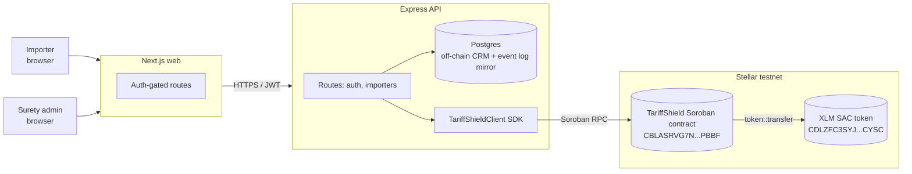

# Architecture

A single Soroban smart contract on Stellar is the system of record for customs-bond collateral. Everything else — TypeScript SDK, Express API, Postgres mirror, Next.js dashboard — is off-chain orchestration around that contract.

---

## 1. System topology



The contract owns truth for collateral, required, reserve, yield, and clawback state. Postgres mirrors metadata and the event log for fast UI rendering — but on-chain state always wins on conflict.

## 2. The Soroban contract

One Rust crate (`contracts/tariff-shield`), 8 entrypoints, 14 cargo tests, 12,284 bytes of optimized wasm.

### Storage

```rust
enum DataKey {
    Admin,            // platform pubkey — registers importers + acts as tariff oracle
    Surety,           // surety pubkey — sole clawback authority
    Token,            // SAC address of the collateral asset (XLM on testnet; USDC in prod)
    Account(Address)  // per-importer state, keyed by importer's Stellar pubkey
}

struct Account {
    bond_id: u64,
    collateral_balance: i128,   // what the bond currently has against it
    required_collateral: i128,  // what the surety requires (oracle-set, reflects tariff exposure)
    reserve_balance: i128,      // auto-top-up pool — the importer's "spare" funds
    yield_accrued: i128,        // simulated BENJI yield
    is_clawbacked: bool,        // frozen flag — set true after surety enforcement
}
```

### Entrypoints

| Function | Caller auth | Effect |
|---|---|---|
| `initialize(admin, surety, token)` | `admin` | One-shot; sets the three instance keys |
| `register_importer(importer, bond_id, required)` | `admin` | Creates a zero-balance `Account` for the importer |
| `deposit_collateral(importer, from, amount)` | `from` | SAC transfer from `from` to contract; credits `collateral_balance` |
| `deposit_reserve(importer, from, amount)` | `from` | SAC transfer to contract; credits `reserve_balance` |
| `set_required_collateral(importer, new_required)` | `admin` | Oracle role — updates the target |
| `auto_top_up(importer) -> i128` | **none** | If `collateral < required`, moves `min(shortfall, reserve)` from reserve to collateral. Returns moved amount. |
| `withdraw_collateral(importer, to, amount)` | `importer` | SAC transfer to `to`; rejected if it would breach `required` |
| `accrue_yield(importer, amount)` | `admin` | Adds to `yield_accrued` (simulated; mainnet wires real BENJI flow) |
| `clawback(importer) -> i128` | `surety` | SAC transfer of `collateral + reserve` to surety; freezes account |
| `get_account(importer) -> Account` | view | Returns full state |
| `get_admin() / get_surety() / get_token()` | view | Configuration introspection |

### Authorization model

Three roles, three keys, three trust scopes:

| Role | Source of truth | Capabilities |
|---|---|---|
| **Admin** (platform) | `DataKey::Admin` | `initialize`, `register_importer`, `set_required_collateral`, `accrue_yield` |
| **Surety** | `DataKey::Surety` | `clawback` only |
| **Importer** | `Address` argument per call | `withdraw_collateral`; deposits authorized by the `from` argument (typically the importer) |

`auto_top_up` is **permissionless** — anyone can poke the contract to advance state. The accounting is deterministic; no privilege boost from being the caller.

### Events

Every state-changing call emits a topic + payload:

```
(registr,  importer) → (bond_id, required_collateral)
(deposit,  importer) → (amount, new_balance)
(reserve,  importer) → (amount, new_reserve)
(required, importer) → (old_required, new_required)
(topup,    importer) → (moved, new_collateral, new_reserve)
(withdraw, importer) → (amount, new_balance)
(yield,    importer) → (amount, total_yield)
(clawback, importer) → total
```

The API mirrors every successful invocation into the `contract_events` table for fast UI rendering and audit.

### Errors

```rust
enum Error {
    NotInitialized = 1,
    AlreadyInitialized = 2,
    ImporterNotRegistered = 3,
    ImporterAlreadyRegistered = 4,
    InvalidAmount = 5,
    CollateralBelowRequired = 6,   // withdrawal would breach required
    AccountFrozen = 7,             // post-clawback
}
```

## 3. The tariff-spike → auto-top-up flow

```mermaid
sequenceDiagram
    autonumber
    participant IMP as Importer (UI)
    participant API as Express API
    participant SDK as TariffShieldClient
    participant SC  as Soroban contract
    participant PG  as Postgres

    Note over IMP,PG: Setup — already deposited 30 XLM collateral + 100 XLM reserve
    IMP->>API: POST /importers/:id/upload-tariff-csv {annualDuty}
    API->>API: bondFace = annualDuty × 10%; required = bondFace × 50%
    API->>SDK: setRequiredCollateral(importer, requiredStroops)
    SDK->>SC: set_required_collateral(...)
    SC-->>SDK: event (required) — old, new
    SDK-->>API: txHash
    API->>PG: INSERT tariff_uploads + contract_events

    Note over IMP,PG: collateral 30 XLM < required 80 XLM → shortfall 50 XLM

    IMP->>API: POST /importers/:id/auto-top-up
    API->>SDK: autoTopUp(importer)
    SDK->>SC: auto_top_up(importer)
    SC->>SC: moved = min(shortfall, reserve) = 50
    SC->>SC: collateral += 50, reserve -= 50
    SC-->>SDK: event (topup); return 50
    SDK-->>API: txHash, movedStroops = 500000000
    API->>PG: INSERT contract_events kind=auto_top_up
    API-->>IMP: {movedStroops, txUrl}
```

The token contract is **not** touched during `auto_top_up` — both buckets are internal accounting fields on the contract. Token transfers only happen on deposits, withdrawals, and clawback.

## 4. Clawback flow

```mermaid
sequenceDiagram
    autonumber
    participant SUR as Surety admin (UI)
    participant API as Express API
    participant SDK as TariffShieldClient
    participant SC  as Soroban contract
    participant SAC as XLM SAC token
    participant SW  as Surety wallet

    SUR->>API: POST /importers/:id/clawback (surety_admin role)
    API->>SDK: clawback(importer) — signed by surety keypair
    SDK->>SC: clawback(importer)
    SC->>SC: total = collateral + reserve
    SC->>SAC: token.transfer(contract → surety, total)
    SAC->>SW: credited
    SAC-->>SC: ok
    SC->>SC: collateral=0, reserve=0, is_clawbacked=true
    SC-->>SDK: event (clawback) → total; return total
    SDK-->>API: txHash, clawedStroops
```

After clawback, any subsequent `deposit_*` / `withdraw_*` / `auto_top_up` / `accrue_yield` on this importer panics with `Error::AccountFrozen`.

## 5. Off-chain data model

```mermaid
erDiagram
    USERS ||--o{ IMPORTERS : "is owner"
    IMPORTERS ||--o{ TARIFF_UPLOADS : "history"
    IMPORTERS ||--o{ CONTRACT_EVENTS : "audit log"

    USERS { uuid id PK; text email; text password_hash; text role; }
    IMPORTERS { uuid id PK; uuid user_id FK; text legal_name; text ein; bigint bond_id; text stellar_address; text registered_on_chain_tx; }
    TARIFF_UPLOADS { uuid id PK; uuid importer_id FK; text filename; numeric annual_duty_total; numeric computed_required_collateral; text applied_tx; }
    CONTRACT_EVENTS { uuid id PK; uuid importer_id FK; text kind; numeric amount; text tx_hash; jsonb raw; }
```

Postgres holds:

- **users** — auth (email, bcrypt hash, role)
- **importers** — CRM (legal name, EIN, bond ID, generated Stellar address)
- **tariff_uploads** — audit history of CSV ingest + computed required collateral
- **contract_events** — mirror of on-chain events for fast UI rendering

The importer's Stellar **secret key** is currently stored in plaintext in `stellar_secret_encrypted` — the column is named for the upcoming migration to AES-256-GCM at rest (see roadmap). This is intentional for the MVP and tracked.

## 6. API reference

### Auth (`/auth`)

```
POST /auth/signup  { email, password, role: "importer" | "surety_admin" }  →  { token, user }
POST /auth/login   { email, password }                                     →  { token, user }
GET  /auth/me                                                              →  { user }
```

JWT bearer, 7-day TTL. Rate-limited 20/15min on signup + login.

### Importers (`/importers`) — `Authorization: Bearer <jwt>` required

| Method | Path | Body | Returns |
|---|---|---|---|
| POST | `/importers` | `{ legalName, ein?, bondId, initialRequiredCollateral }` | `{ importer }` — generates Stellar keypair, funds via friendbot, registers on-chain |
| GET | `/importers` | — | `{ importers[] }` (scoped: importer sees own; surety_admin sees portfolio) |
| GET | `/importers/:id` | — | `{ importer, onChainAccount, events[] }` |
| POST | `/importers/:id/upload-tariff-csv` | `{ filename?, annualDutyTotal }` | `{ requiredCollateralStroops, txHash, txUrl }` |
| POST | `/importers/:id/deposit` | `{ amountStroops, bucket: "collateral" | "reserve" }` | `{ txHash, txUrl }` |
| POST | `/importers/:id/auto-top-up` | — | `{ movedStroops, txHash, txUrl }` |
| POST | `/importers/:id/withdraw` | `{ amountStroops }` | `{ txHash, txUrl }` |
| POST | `/importers/:id/accrue-yield` | `{ amountStroops }` (surety_admin only) | `{ txHash, txUrl }` |
| POST | `/importers/:id/clawback` | — (surety_admin only) | `{ clawedStroops, txHash, txUrl }` |

## 7. SDK

The TypeScript SDK (`packages/sdk`) wraps the contract over Soroban RPC. Every write method takes a `Keypair`, builds the invocation, prepares it with footprint + auth via the RPC, signs, submits, polls for confirmation, and returns `{ txHash, result }` with the result decoded from XDR. Read methods are simulated only — no signing or submission.

```ts
import { TariffShieldClient } from "@tariffshield/sdk";

const client = new TariffShieldClient({
  rpcUrl: "https://soroban-testnet.stellar.org",
  contractId: "CBLASRVG7NRAFP2CDPVSF4WTJBKC6L4FKT2XHR3OH7CLICUBPVQ4PBBF",
  networkPassphrase: "Test SDF Network ; September 2015",
});

// Read
const account = await client.getAccount(importerAddress);

// Write
const { txHash, result } = await client.autoTopUp(platformKeypair, importerAddress);
```

## 8. Environment

### Smart contract toolchain

- `rustc` 1.94+ with `wasm32-unknown-unknown` target
- `soroban-sdk` v22
- `stellar` CLI v25.2

Build pipeline:

```bash
cargo build --target wasm32-unknown-unknown --release
stellar contract optimize --wasm target/.../tariff_shield.wasm
stellar contract deploy --network testnet --source-account <admin> --wasm <wasm>
stellar contract invoke --id <C…> -- initialize --admin <G…> --surety <G…> --token <SAC…>
```

### API env (`apps/api/.env`)

| Var | Purpose |
|---|---|
| `DATABASE_URL` | Postgres URL (auto-SSL when `sslmode=require`) |
| `PORT` | API port (default 3002) |
| `FRONTEND_ORIGIN` | CORS allowlist (comma-separated) |
| `JWT_SECRET` | HMAC secret for JWT bearer tokens (32+ chars) |
| `STELLAR_RPC_URL` | Soroban RPC URL |
| `STELLAR_NETWORK_PASSPHRASE` | Network passphrase |
| `TARIFF_SHIELD_CONTRACT_ID` | Deployed contract address |
| `PLATFORM_STELLAR_SECRET` | Admin keypair secret (the orchestrator) |
| `SURETY_STELLAR_SECRET` | Surety keypair secret (clawback signer) |

### Web env (`apps/web/.env.local`)

| Var | Purpose |
|---|---|
| `NEXT_PUBLIC_API_URL` | API base URL |
| `NEXT_PUBLIC_CONTRACT_ID` | Contract ID (informational, surfaced in UI) |
| `NEXT_PUBLIC_STELLAR_NETWORK` | `testnet` or `public` |

## 9. Production hardening

- `helmet({ contentSecurityPolicy: false, crossOriginResourcePolicy: { policy: "cross-origin" } })`
- `app.set("trust proxy", 1)` (behind Render edge)
- `express-rate-limit` 20/15min on `/auth/signup` + `/auth/login`
- CORS allowlist via `FRONTEND_ORIGIN` (localhost:3000 always permitted)
- `pg` auto-SSL when `sslmode=require` in `DATABASE_URL`
- bcrypt cost 12 for password hashing
- JWT HS256, 7-day TTL

## 10. Roadmap

These are scoped tasks with effort labels (S/M/L/XL) — clean entry points for contributors.

| # | Title | Layer | Effort |
|---|---|---|---|
| 1 | Live CBP ACE API integration via surety relay | API | L |
| 2 | Sumsub / Smile Identity KYC for importer onboarding | API + UI | M |
| 3 | Real Franklin Templeton BENJI yield routing | Contract + API | M |
| 4 | Mainnet config + Circle USDC swap (KYC asset with `auth_required` + `clawback` flags) | Contract + Ops | M |
| 5 | Encrypted-at-rest importer Stellar secrets (AES-256-GCM) | API | S |
| 6 | Surety admin SAML + claims-history export | API + UI | M |
| 7 | Per-state surety insurance regulator filings | Ops | L |
| 8 | Tariff-spike alert system (email + SMS via Twilio) | API | S |
| 9 | Multi-importer-entity support (subsidiaries, related parties) | Contract + API | M |
| 10 | Path-payment fallback when surety wallet currency ≠ USDC | API | M |
| 11 | SOC 2 type II + ISO 27001 prep | Ops | XL |
| 12 | On-chain immutable event log export for state regulators | API | S |
| 13 | CI: `cargo test` + wasm size budget gate | Infra | S |
| 14 | Indexer: subscribe to contract events via Soroban RPC → populate Postgres mirror | API | M |
| 15 | Bond-policy templates (continuous vs single-entry vs ATA Carnet) | Contract | M |
| 16 | Hardware wallet support for surety admin (Ledger via stellar-base) | UI | M |

## 11. Repo layout (full)

```
tariffshield/
├── README.md  ARCHITECTURE.md  PITCH.md
├── package.json                       (npm workspaces)
├── Cargo.toml                         (Rust workspace)
├── tsconfig.base.json
├── docker-compose.yml
├── deployments.json
├── .env.example  .gitignore
├── contracts/
│   └── tariff-shield/
│       ├── Cargo.toml
│       └── src/
│           ├── lib.rs                 (8 entrypoints + storage)
│           ├── errors.rs              (7 contract errors)
│           └── test.rs                (14 cargo unit tests)
├── packages/sdk/
│   ├── package.json  tsconfig.json
│   └── src/index.ts                   (TariffShieldClient)
├── apps/
│   ├── api/
│   │   ├── package.json  tsconfig.json
│   │   └── src/
│   │       ├── index.ts               (boot, CORS, helmet, rate-limit)
│   │       ├── env.ts                 (Zod env loader)
│   │       ├── db.ts                  (pg pool + migrations)
│   │       ├── auth.ts                (JWT + bcrypt + middleware)
│   │       ├── stellar.ts             (SDK + keypair wiring)
│   │       └── routes/{auth,importers}.ts
│   └── web/
│       ├── package.json  tsconfig.json  next.config.ts  postcss.config.mjs
│       ├── app/
│       │   ├── globals.css  layout.tsx  page.tsx
│       │   ├── signup/page.tsx  login/page.tsx
│       │   ├── app/page.tsx           (importer dashboard)
│       │   └── surety/
│       │       ├── page.tsx           (portfolio)
│       │       └── [id]/page.tsx      (importer detail + clawback)
│       ├── components/Nav.tsx
│       └── lib/{api,auth}.ts
└── scripts/sdk-smoke.ts               (read-only health check)
```
