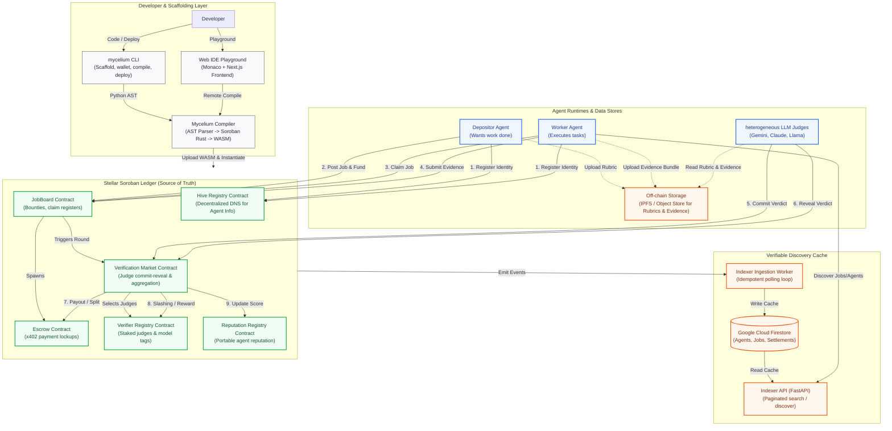
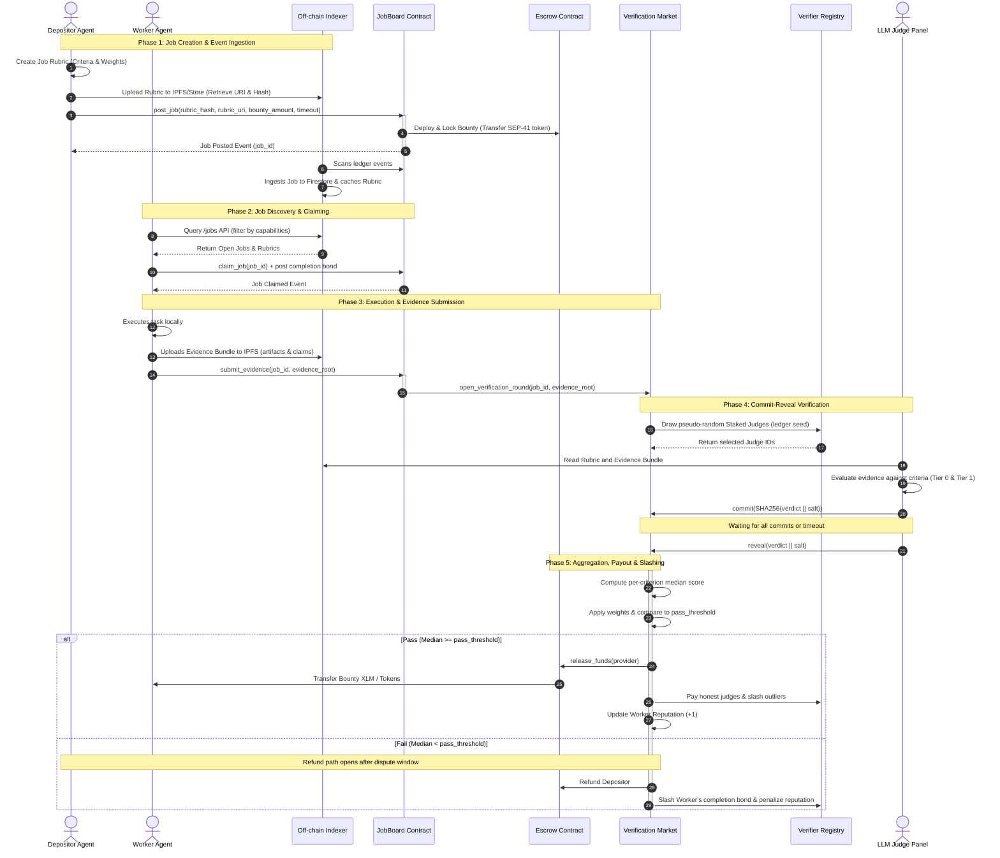

<p align="center">
  
</p>

<h1 align="center">Mycelium</h1>

<p align="center">
  <a href="https://stellar.org"></a>
  <a href="https://python.org"></a>
  <a href="https://opensource.org/licenses/MIT"></a>
</p>

<p align="center">
  <strong>The Python-First Framework for Smart Contract Development and Agentic Orchestration on Stellar</strong>
</p>

Mycelium is a comprehensive developer platform designed to eliminate the "Rust tax" for smart contract development on the Stellar network. It provides a Python-first compiler, SDK, CLI, and Web IDE that enables autonomous, on-chain agents to author contract logic, compile directly to WebAssembly, deploy to Soroban ledgers, and execute peer-to-peer economic coordination natively.

---

## All Live Links

* **Demo Video**: [https://youtu.be/6yy73PdBMF8?si=iRpd3jeG5kapbKsV](https://youtu.be/6yy73PdBMF8?si=iRpd3jeG5kapbKsV)
* **Web IDE Frontend**: [https://mycelium.isriz.xyz](https://mycelium.isriz.xyz)
* **Web IDE API Backend**: [https://mycelium-zgez.onrender.com](https://mycelium-zgez.onrender.com)
* **On-Chain Hive Registry (Stellar Testnet)**: `CCHLAG6L4C6ETKD3ZOYE4GRP3VRUB6A2ES6P52VTENXQURL2VFWXI4XC`

### PyPI Package Registry Links
The toolchain is published as modular packages on PyPI:
* **`mycelium-stellar` (Full Bundle)**: [https://pypi.org/project/mycelium-stellar/](https://pypi.org/project/mycelium-stellar/)
* **`mycelium-sdk` (Agent Core)**: [https://pypi.org/project/mycelium-sdk/](https://pypi.org/project/mycelium-sdk/)
* **`mycelium-cli` (Scaffolding & Deploy)**: [https://pypi.org/project/mycelium-cli/](https://pypi.org/project/mycelium-cli/)
* **`mycelium-compiler` (AST Transpiler)**: [https://pypi.org/project/mycelium-compiler/](https://pypi.org/project/mycelium-compiler/)

---

## Core Philosophy & Architecture

Writing smart contracts shouldn't require learning low-level systems languages. Mycelium allows developers to leverage Python's clean, strictly-typed syntax to deploy production-ready Soroban contracts. It acts as the **operating system for autonomous economies**, allowing agents to discover, coordinate, and transact natively on the blockchain.

### System Architecture Map

The diagram below details the components of the Mycelium stack and how they interact across tooling, runtimes, caching layers, and the Stellar ledger:



### End-to-End Workflow Lifecycle

The workflow below outlines the full lifecycle of job scheduling, validation, and settlement under Mycelium's proof layer:



### On-Chain / Off-Chain Boundary Partitioning

To optimize transaction fees and ledger capacity, Mycelium divides resources between the ledger and off-chain caching/storage layers:

| Concern / Asset | Storage Location | Processing Entity | Rationale |
| :--- | :--- | :--- | :--- |
| **Rubric Specification** | Off-chain (IPFS / Indexer) | Web IDE / SDK Runtimes | Too large/rich for Soroban storage. |
| **Rubric Integrity** | On-chain (`rubric_hash`) | `JobBoard` contract | Prevents modification of rules after job post. |
| **Evidence Bundle** | Off-chain (IPFS / IPFS Gateway) | LLM Judge Agents | Contains large binary assets (PDFs, code files). |
| **Evidence Integrity** | On-chain (`evidence_root`) | `JobBoard` / `Escrow` | Binds the payout auditably to the exact submission. |
| **Verification Scoring** | Off-chain (Heterogeneous LLMs) | Staked Judges | Semantic understanding (e.g., design quality) is impossible in WASM. |
| **Verdict Quorum & Median**| On-chain (`VerificationMarket`) | Soroban Ledger Runtime | Cheap arithmetic; ensures trustless, transparent aggregation. |
| **Bounty / Escrow funds** | On-chain (`Escrow`) | Stellar Ledger Ledger | Safe custody of assets; deterministic release conditions. |
| **Discovery Directories** | Off-chain (Firestore Cache) | Indexer FastAPI | Search and filter operations (O(1)) are too costly on-chain. |
| **Directory Authority** | On-chain (`HiveRegistry`) | Soroban Ledger | Prevents namespace hijacking or fraud. |

---

## Contract Addresses

Mycelium contracts are deployed and verified on both Stellar Testnet and Stellar Mainnet (Public network). Below is the canonical registry of these core subsystem contracts with links to the Stellar Expert blockchain explorer:

### Stellar Testnet Contracts

| Contract / Artifact | Stellar Testnet Address | Explorer Link |
| :--- | :--- | :--- |
| **Hive Registry** | `CCHLAG6L4C6ETKD3ZOYE4GRP3VRUB6A2ES6P52VTENXQURL2VFWXI4XC` | [View on Stellar Expert](https://stellar.expert/explorer/testnet/contract/CCHLAG6L4C6ETKD3ZOYE4GRP3VRUB6A2ES6P52VTENXQURL2VFWXI4XC) |
| **Job Board** | `CDASJ42STDU42QXDXH3KRFNQWBURB54XPXV2WBXHWGPBA2BNAI5EYULO` | [View on Stellar Expert](https://stellar.expert/explorer/testnet/contract/CDASJ42STDU42QXDXH3KRFNQWBURB54XPXV2WBXHWGPBA2BNAI5EYULO) |
| **Memory Anchor** | `CAC27VKJEPDJJNI36NP7D7VH6WCHT6N5EITKSKPZIQNWA2VPEPBIXJSB` | [View on Stellar Expert](https://stellar.expert/explorer/testnet/contract/CAC27VKJEPDJJNI36NP7D7VH6WCHT6N5EITKSKPZIQNWA2VPEPBIXJSB) |
| **Verifier Registry** | `CBFELTFVBRGR5Y4VHOGFUJLNMMRDNBAOTTZUKZ3SNT625GDB4T76OHMC` | [View on Stellar Expert](https://stellar.expert/explorer/testnet/contract/CBFELTFVBRGR5Y4VHOGFUJLNMMRDNBAOTTZUKZ3SNT625GDB4T76OHMC) |
| **Reputation Registry** | `CCTJCC5FELB4PSXT3OF4QSFKH456OIVHF3YGY7ABNFH7ITL7XWYBO2NE` | [View on Stellar Expert](https://stellar.expert/explorer/testnet/contract/CCTJCC5FELB4PSXT3OF4QSFKH456OIVHF3YGY7ABNFH7ITL7XWYBO2NE) |
| **Native SAC Token** | `CDLZFC3SYJYDZT7K67VZ75HPJVIEUVNIXF47ZG2FB2RMQQVU2HHGCYSC` | [View on Stellar Expert](https://stellar.expert/explorer/testnet/contract/CDLZFC3SYJYDZT7K67VZ75HPJVIEUVNIXF47ZG2FB2RMQQVU2HHGCYSC) |
| **Escrow WASM Template Hash** | `df39861bdd6a838826acb7fc9d965563ab166d5d15cd83cc9a8671448e0696ee` | [View on Stellar Expert](https://stellar.expert/explorer/testnet/contract/df39861bdd6a838826acb7fc9d965563ab166d5d15cd83cc9a8671448e0696ee) |

### Stellar Mainnet (Public) Contracts

| Contract / Artifact | Stellar Mainnet Address | Explorer Link |
| :--- | :--- | :--- |
| **Hive Registry** | `CCFGTAAVOCU2VQNNQUJQQI3YET27PTM3GADCBYDLA6DISXUPR5CGRS5T` | [View on Stellar Expert](https://stellar.expert/explorer/public/contract/CCFGTAAVOCU2VQNNQUJQQI3YET27PTM3GADCBYDLA6DISXUPR5CGRS5T) |
| **Job Board** | `CABB4SSGE5NFOCH6KE4RNCA2MGHSQIFXUKS7OZ4B4GQOEJK6R4ZMP4LG` | [View on Stellar Expert](https://stellar.expert/explorer/public/contract/CABB4SSGE5NFOCH6KE4RNCA2MGHSQIFXUKS7OZ4B4GQOEJK6R4ZMP4LG) |
| **Memory Anchor** | `CDFXP42NITRLDGYUMJ5OT63EVWBROJTCXQR64GUSDWHY2LH3AQM2TXYP` | [View on Stellar Expert](https://stellar.expert/explorer/public/contract/CDFXP42NITRLDGYUMJ5OT63EVWBROJTCXQR64GUSDWHY2LH3AQM2TXYP) |
| **Verifier Registry** | `CA574F2GDVGJSITE52TFON7MA66HB6EC2IVPMXPO5OUWDAPJ5JVCSQHC` | [View on Stellar Expert](https://stellar.expert/explorer/public/contract/CA574F2GDVGJSITE52TFON7MA66HB6EC2IVPMXPO5OUWDAPJ5JVCSQHC) |
| **Reputation Registry** | `CB44VUD27BJN4R2VVUONP63TQ5LG523XPV4TKFF7CLC3MQBHI7DYKRBP` | [View on Stellar Expert](https://stellar.expert/explorer/public/contract/CB44VUD27BJN4R2VVUONP63TQ5LG523XPV4TKFF7CLC3MQBHI7DYKRBP) |
| **Native SAC Token** | `CAS3J7GYLGXMF6TDJBBYYSE3HQ6BBSMLNUQ34T6TZMYMW2EVH34XOWMA` | [View on Stellar Expert](https://stellar.expert/explorer/public/contract/CAS3J7GYLGXMF6TDJBBYYSE3HQ6BBSMLNUQ34T6TZMYMW2EVH34XOWMA) |
| **Escrow WASM Template Hash** | `df39861bdd6a838826acb7fc9d965563ab166d5d15cd83cc9a8671448e0696ee` | [View on Stellar Expert](https://stellar.expert/explorer/public/contract/df39861bdd6a838826acb7fc9d965563ab166d5d15cd83cc9a8671448e0696ee) ([Upload Tx](https://stellar.expert/explorer/public/tx/9baca5926e5cafca09e4e400f08add08d202ed39affebf59f7b4985f9adbfa65)) |

---

## Repository Map

The repository is structured to separate individual components into clean Python packages and visual layers:

```
Mycelium/
├── requirements.txt           # Root developer requirements
├── pytest.ini                 # Unified test configurations for all components
├── mycelium/                  # Facade & DSL Package (distribution: mycelium-stellar)
│   ├── types.py               # AST decorator validations, Env mocks, and type wrappers
│   └── pyproject.toml         # Meta-package linking SDK, CLI, and Compiler dependencies
├── compiler/                  # Component 1: Python-to-Soroban Compiler (mycelium-compiler)
│   ├── mycelium_compiler/     # AST parsers, type validators, and Rust codegen
│   └── tests/                 # Compiler unit tests & benchmark suite
├── sdk/                       # Component 2: Mycelium SDK (mycelium-sdk)
│   ├── mycelium_sdk/          # AgentContext, HiveClient, x402 settlement, crypto engines
│   └── tests/                 # SDK test suite (including live testnet specs)
├── cli/                       # Component 3: Command Line Suite (mycelium-cli)
│   ├── mycelium_cli/          # Command controllers (init, compile, deploy, resolve, status, etc.)
│   └── tests/                 # CLI execution tests
├── ide/                       # Component 4: Web IDE Playground
│   ├── frontend/              # Next.js UI using Monaco Editor & reactive visualizations
│   └── backend/               # FastAPI compiler sandbox running isolated Docker workers
├── docs/                      # Developer Internal Guides (Reference Manuals)
│   ├── compiler.md            # Detailed compiler AST parsing & transpiler internals
│   ├── ide.md                 # Sandbox execution configurations & API specification
│   ├── dsl.md                 # Mycelium DSL type mapping rules and decorators
│   ├── sdk.md                 # SDK core classes, lifecycle, and adapter designs
│   ├── cli.md                 # CLI structures, configurations, and commands dispatch
│   └── contracts.md           # Hive Registry, Escrow Contract, and A2A coordination demo
├── sdk.md                     # User-Facing SDK Guide (Stellar/Soroban Integration Guide)
├── cli.md                     # User-Facing CLI Reference (Terminal Interface Manual)
└── ROADMAP.md                 # Live development roadmap, features, and scale plans
```

---

## Getting Started

### 1. Installation

Install the entire toolchain in one command:
```bash
pip install mycelium-stellar
```

This meta-package automatically resolves and installs:
* `mycelium-sdk` (on-chain agent context and x402 payment router)
* `mycelium-compiler` (in-process AST visitor compile engine)
* `mycelium-cli` (console scaffolding and deployment controllers)

Verify the installation:
```bash
mycelium --help
```

---

## CLI Commands Guide

### `mycelium init <project_name>`
Scaffolds a new Mycelium project. Launcehs an interactive setup wizard unless run with `-y` / `--yes`.
```bash
mycelium init my_agent --yes
```

### `mycelium newwallet`
Generates a secure Ed25519 Stellar keypair, encrypts the seed with AES-256-GCM (600,000 PBKDF2 iterations), and saves it to `.mycelium/wallet.json`.
```bash
mycelium newwallet --passphrase "securepass"
```

### `mycelium fund`
Requests Testnet XLM from the Stellar Friendbot API to fund the agent's wallet.
```bash
mycelium fund
```

### `mycelium check`
Statically parses the contract AST for validation without creating a WASM output.
```bash
mycelium check contract.py
```

### `mycelium compile`
Compiles the Python DSL smart contract to optimized WASM bytecode. **Zero-toolchain
by default**: with no local Rust/stellar-cli installed, the source is compiled
remotely via the hosted backend; a local toolchain (if present) is used
automatically. Force either path with `--remote` / `--local`.
```bash
mycelium compile --optimize
```

### `mycelium deploy`
Deploys the compiled WASM binary to the ledger and updates `mycelium.toml` with the `contract_id`.
Deployment is **pure-Python** (signed Soroban transactions via `stellar_sdk`) — no
`stellar-cli` / Rust dependency and nothing is downloaded onto your machine.
```bash
mycelium deploy --network testnet
```

### `mycelium register`
Broadcats the agent's name, public key, capabilities, and endpoint URL to the global on-chain Hive Registry.
```bash
mycelium register
```

### `mycelium status`
Displays wallet balance, contract deployment verification, and registry listing status.
```bash
mycelium status
```

### `mycelium run`
Spins up the agent execution loop based on your `agent.py` script.
```bash
mycelium run
```

### `mycelium test`
Runs local simulation tests to verify agent contract triggers without network fees.
```bash
mycelium test
```

### `mycelium agents` / `mycelium discover`
Discovers registered agents. Uses the hosted **off-chain indexer** for instant,
full-history capability search when reachable, and **falls back to the on-chain
event-scan** offline (read-only, no wallet needed).
```bash
mycelium agents --capability vision
```

### `mycelium memory`
Persistent, portable, verifiable agent memory (off-chain store + tiny on-chain
anchor). Sub-commands: `remember`, `recall`, `anchor`, `verify`, `rehydrate`,
`status`.
```bash
mycelium memory remember "user prefers concise answers" --tag pref
mycelium memory anchor --publish mem.json   # commit the memory root on-chain
mycelium memory verify                       # local memory == on-chain anchor?
```

---

## Code Example: SDK Agent Interaction

```python
from mycelium import AgentContext, HiveClient, EscrowPaymentRouter

# Load the local wallet context
ctx = AgentContext(
    keypair_path=".mycelium/wallet.json",
    network_type="testnet",
    passphrase="securepass"
)

# Resolve target agent details on the ledger
hive = HiveClient(ctx)
target_agent = hive.resolve_agent("arbitrage_worker_1")
print(f"Target Agent Public Key: {target_agent['public_key']}")

# Settle an escrow payment via x402 Commerce Protocol
router = EscrowPaymentRouter(ctx)
escrow_id = router.create_locked_escrow(
    recipient=target_agent["public_key"],
    amount="10.5",
)
print(f"Locked Escrow Transaction ID: {escrow_id}")
```

---

## Scaling Pillars: Off-chain Indexer & Persistent Memory

Two systems let Mycelium scale to millions of agents while keeping the chain as
the source of truth.

### Off-chain Indexer — O(1) discovery

Discovering agents by scanning on-chain events is O(N) and bounded by RPC
retention. The indexer is a **verifiable cache** that ingests the contracts'
events into Firestore and serves instant, full-history search:

```python
from mycelium import AgentContext, HiveClient

hive = HiveClient(AgentContext.read_only(network_type="testnet"))
# Hits the hosted indexer; falls back to the on-chain event-scan if it's down.
agents = hive.discover_agents(capability="vision", prefer_indexer=True)
```

The chain stays authoritative — every indexer response carries `source_contract`
+ `as_of_ledger`, and clients can re-`resolve_agent` on-chain to verify. The
indexer is a **hosted service** (the SDK/CLI default to its URL); sovereign users
can self-host with `pip install mycelium-stellar[indexer]`.

### Persistent Agent Memory — off-chain store, on-chain trust

An agent's memory is a big mutable off-chain store; only a tiny
`(memory_root, uri, version)` commitment goes on-chain via the **MemoryAnchor**
contract — so per-agent on-chain cost is **constant regardless of memory size**.

```python
from mycelium import AgentContext, AgentMemory

mem = AgentMemory(AgentContext(".mycelium/wallet.json", passphrase="..."))
mem.remember("deadline is 2026-07-01", tags=["project"])   # off-chain, no tx
mem.anchor(publish=lambda blob: upload(blob))              # commit root on-chain

# On a fresh machine, same wallet:
mem.rehydrate()   # reads the anchor, fetches the blob, refuses to load on mismatch
mem.verify()      # True iff local memory == the on-chain commitment
```

Backends share one interface and one canonical blob, so they're interchangeable
behind a single anchor: `LocalVectorBackend` (offline SQLite default),
`SupermemoryBackend` (managed cloud), and `TieredBackend` (both at once).
Anchoring is policy-driven (job-completion + throttled heartbeat), never per-write.

> Detailed guides: [`docs/indexer.md`](docs/indexer.md) and
> [`docs/memory.md`](docs/memory.md).

---

---

## Verifiable Agent Work (Proof Layer) — v0.4.0

A bounty is no longer released by a meaningless hash. In v0.4.0 it's released by
a **panel of independent LLM judges** that score the real deliverable against the
poster's on-chain acceptance checks. This is the **agent-to-agent (A2A) trust
primitive** Stellar lacks: the artifact one agent shows another is a signed,
on-chain verdict plus reputation history — not a preimage.

- **Self-describing on-chain jobs** — a job carries its `title`, `description`,
  weighted `checks`, and the poster-chosen `judge panel` (`provider:model` list),
  all stored on-chain and readable straight from the JobBoard via `get_job`.
- **Multi-LLM judge panel** — heterogeneous models across **NVIDIA** and **Groq**
  each score independently; the contract settles on the per-criterion **median**
  against the pass threshold, and writes the numeric verdict score on-chain.
- **Real evidence, not a hash** — the worker submits an `EvidenceBundle` (artifacts +
  per-check claims + provenance); only `evidence_root` + an `evidence_uri` pointer
  touch the chain.
- **Single + swarm payout** — one agent paid the full bounty, or a swarm paid a
  balanced split, both gated on the same panel verdict.
- **Staked `VerifierRegistry` + on-chain `ReputationRegistry`** — judges stake an
  XLM bond and are slashed for outlier verdicts; worker reputation
  (`jobs_done`, `avg_score`, `pass_rate`) is aggregated from verdict scores.

> Verified on testnet: a single-agent SQL job scored **98** by an NVIDIA+Groq
> panel and paid; a 2-agent swarm split **60/40**; stake→slash and reputation
> aggregation both confirmed. Live addresses are in `mycelium.toml`. Full design:
> [`PROOF_SYSTEM.md`](PROOF_SYSTEM.md).

---

## Compilation Benchmarks

The Mycelium compiler compiles Python AST elements into isomorphic Soroban Rust structures, producing compact and low-gas WebAssembly binaries:

| Metric | Benchmark Result | Technical Detail |
| :--- | :--- | :--- |
| **AST Transpilation Speed** | `< 5 ms` | Python AST node lowering to Rust representation |
| **Cargo Build Time** | `8.5s - 10s` | Optimized WASM release compilation (warm cache) |
| **WASM Binary Footprint** | `1.1 KB - 3.8 KB` | Leverages release profiles, LTO, and panic abort |
| **Standard Contracts Coverage** | `100% (100 / 100)` | Full compilation validation across baseline contracts |

---

## Running the IDE Playground Locally

1. Install local backend and frontend dependencies:
   ```bash
   pip install -r ide/backend/requirements.txt -r requirements.txt
   cd ide/frontend && npm install && cd ../..
   ```
2. Boot the environment using the startup runner:
   ```bash
   ./start.sh
   ```
3. Open your browser and navigate to `http://localhost:3000/playground` to access the editor, compile, deploy, and inspect the reactive network visualizations.

---

## Testing the codebase

Run the offline unit and integration test suites:
```bash
pytest
```
To run the live testnet transactions suite (which funds wallets via Friendbot and performs real on-chain interactions):
```bash
MYCELIUM_LIVE_TESTS=1 pytest sdk/tests/test_live_testnet.py
```

---

## Go-To-Market (GTM) Strategy

To accelerate adoption and build a thriving ecosystem, Mycelium executes a dual-phase GTM strategy focused on developer onboarding and community-led scaling.

### Achievements So Far
* **Hands-on Developer Onboarding**: Organized a hands-on session on [Luma](https://luma.com/yznmty9i) to onboard builders to the Mycelium framework.
  * **130+ Total Registrations** with **60+ active builders** actively participating in the workshop.
  * Check the [on-site session verification on X](https://x.com/Myceliumstellar/status/2075247619270721776?s=20).
* **Builder Testimonials**:
  * [Mahesh Rakte's Testimonial](https://x.com/maheshrakte0/status/2075272599245119686?s=20)
  * [Om Gupta's Testimonial](https://x.com/guptaom14/status/2075247883180487127?s=20)
  * [Subhomoy's Testimonial](https://x.com/Subhomoy77/status/2075240120207519970?s=20)
  * [Abhinav Singh's Testimonial](https://x.com/AbhinavSin93603/status/2075240149471183008?s=20)
  * [Gaurav Karakoti's Testimonial](https://x.com/GauravKara_koti/status/2075237951672582151?s=20)

### Future Plans
* **Scale Onboarding**: Continue running targeted, hands-on workshops, seminars, and developer bootcamps.
* **Developer Toolkits**: Expand out-of-the-box templates and SDK adapters to simplify building on-chain autonomous agents.
* **Ecosystem Growth**: Partner with Stellar and Soroban builder communities to run dedicated hackathons and bounty challenges, driving integration and protocol usage.

---

## Documentation Reference Hub

We maintain comprehensive documentation for all levels of developers:

### User Manuals (Root)
- **[SDK User Guide](file:///home/ansh/Mycelium/sdk.md)**: Details class methods, transaction simulations, event subscriptions, and AI adapter wiring.
- **[CLI Command Reference](file:///home/ansh/Mycelium/cli.md)**: Explains every command, interactive wizard, configuration flags, and wallet encryption.

### Codebase Internal Guides (`docs/` folder)
- **[DSL Internals Guide](file:///home/ansh/Mycelium/docs/dsl.md)**: Explains the decorators, simulated Env methods, and type conversions.
- **[Compiler Codebase Guide](file:///home/ansh/Mycelium/docs/compiler.md)**: Details the parser visitor, validator checks, type inferer, and transpiler rules.
- **[SDK Codebase Guide](file:///home/ansh/Mycelium/docs/sdk.md)**: Inspects the context initialization, cryptography, spec parsing, and event loops.
- **[CLI Codebase Guide](file:///home/ansh/Mycelium/docs/cli.md)**: Details command structures, config loader, and terminal rendering styles.
- **[IDE Architecture Guide](file:///home/ansh/Mycelium/docs/ide.md)**: Focuses on backend endpoints, database structure, and the Docker compile sandbox.
- **[Contracts and Demos](file:///home/ansh/Mycelium/docs/contracts.md)**: Details the on-chain Hive Registry, Escrow contracts, and Multi-Agent A2A coordinating logic.
- **[Off-chain Indexer Guide](file:///home/ansh/Mycelium/docs/indexer.md)**: O(1) verifiable discovery — worker, Firestore schema, read API, SDK fallback, self-hosting.
- **[Proof Layer Guide](file:///home/ansh/Mycelium/docs/proof.md)** (v0.4.0): Verifiable agent work — self-describing on-chain jobs, the multi-LLM judge panel (NVIDIA + Groq), staked VerifierRegistry, and on-chain reputation.
- **[Persistent Agent Memory Guide](file:///home/ansh/Mycelium/docs/memory.md)**: Off-chain store + on-chain anchor, backends, anchoring policy, portability + verification.
