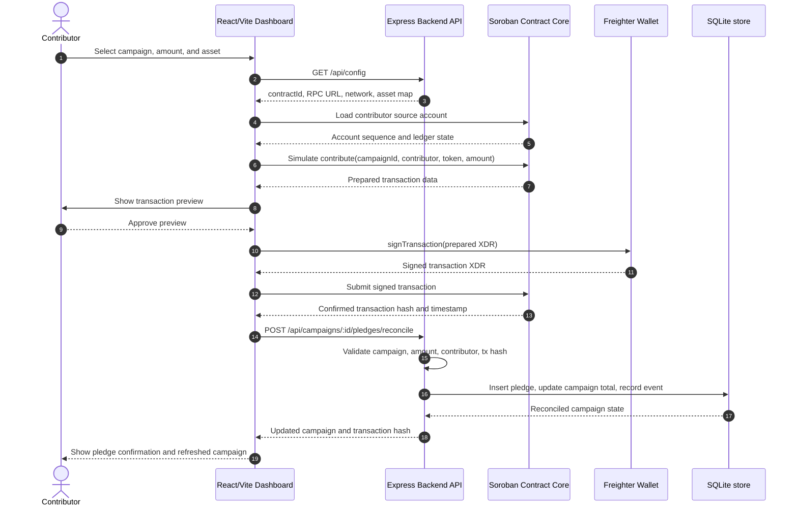
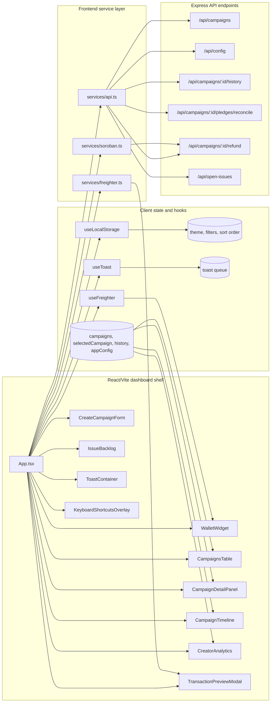
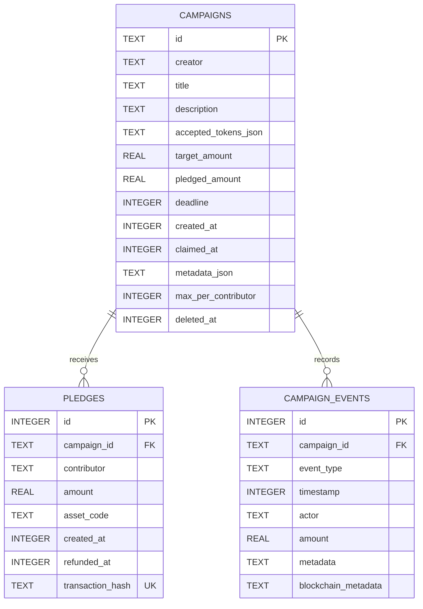
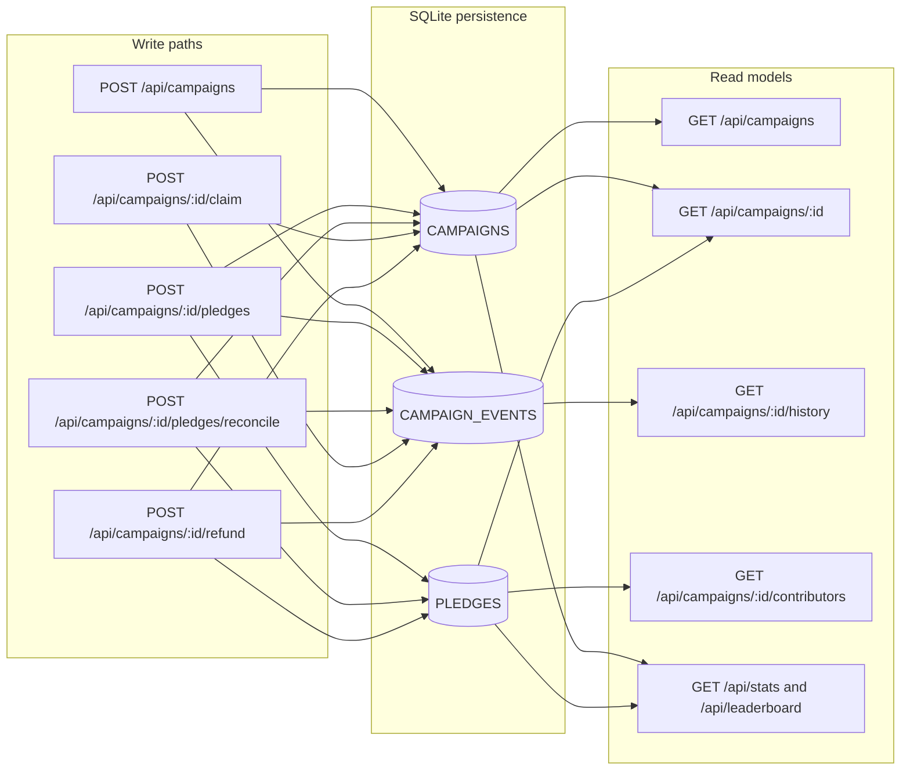

# Stellar Goal Vault Architecture

This page captures the main runtime flows in GitHub-renderable Mermaid diagrams.

## Pledge Flow

```mermaid
sequenceDiagram
    autonumber
    actor Contributor
    participant Frontend as React/Vite Dashboard
    participant Backend as Express Backend API
    participant Soroban as Soroban Contract Core
    participant Freighter as Freighter Wallet
    participant SQLite as SQLite store

    Contributor->>Frontend: Select campaign, amount, and asset
    Frontend->>Backend: GET /api/config
    Backend-->>Frontend: contractId, RPC URL, network, asset map
    Frontend->>Soroban: Load contributor source account
    Soroban-->>Frontend: Account sequence and ledger state
    Frontend->>Soroban: Simulate contribute(campaignId, contributor, token, amount)
    Soroban-->>Frontend: Prepared transaction data
    Frontend->>Contributor: Show transaction preview
    Contributor-->>Frontend: Approve preview
    Frontend->>Freighter: signTransaction(prepared XDR)
    Freighter-->>Frontend: Signed transaction XDR
    Frontend->>Soroban: Submit signed transaction
    Soroban-->>Frontend: Confirmed transaction hash and timestamp
    Frontend->>Backend: POST /api/campaigns/:id/pledges/reconcile
    Backend->>Backend: Validate campaign, amount, contributor, tx hash
    Backend->>SQLite: Insert pledge, update campaign total, record event
    SQLite-->>Backend: Reconciled campaign state
    Backend-->>Frontend: Updated campaign and transaction hash
    Frontend-->>Contributor: Show pledge confirmation and refreshed campaign
```

## Frontend Components

```mermaid
flowchart LR
    subgraph Shell["React/Vite dashboard shell"]
        App["App.tsx"]
        WalletWidget["WalletWidget"]
        CampaignsTable["CampaignsTable"]
        DetailPanel["CampaignDetailPanel"]
        CreateForm["CreateCampaignForm"]
        Timeline["CampaignTimeline"]
        Analytics["CreatorAnalytics"]
        Backlog["IssueBacklog"]
        Preview["TransactionPreviewModal"]
        Toasts["ToastContainer"]
        Shortcuts["KeyboardShortcutsOverlay"]
    end

    subgraph State["Client state and hooks"]
        FreighterHook["useFreighter"]
        LocalStorageHook["useLocalStorage"]
        ToastHook["useToast"]
        AppState[("campaigns, selectedCampaign, history, appConfig")]
        Preferences[("theme, filters, sort order")]
        Notifications[("toast queue")]
    end

    subgraph Services["Frontend service layer"]
        ApiService["services/api.ts"]
        FreighterService["services/freighter.ts"]
        SorobanService["services/soroban.ts"]
    end

    subgraph BackendRoutes["Express API endpoints"]
        CampaignRoutes["/api/campaigns"]
        ConfigRoute["/api/config"]
        HistoryRoute["/api/campaigns/:id/history"]
        ReconcileRoute["/api/campaigns/:id/pledges/reconcile"]
        RefundRoute["/api/campaigns/:id/refund"]
        IssuesRoute["/api/open-issues"]
    end

    App --> WalletWidget
    App --> CampaignsTable
    App --> DetailPanel
    App --> CreateForm
    App --> Timeline
    App --> Analytics
    App --> Backlog
    App --> Preview
    App --> Toasts
    App --> Shortcuts

    App --> FreighterHook
    App --> LocalStorageHook
    App --> ToastHook
    FreighterHook --> WalletWidget
    LocalStorageHook --> Preferences
    ToastHook --> Notifications
    AppState --> CampaignsTable
    AppState --> DetailPanel
    AppState --> Timeline
    AppState --> Analytics

    App --> ApiService
    App --> FreighterService
    App --> SorobanService
    ApiService --> CampaignRoutes
    ApiService --> ConfigRoute
    ApiService --> HistoryRoute
    ApiService --> ReconcileRoute
    ApiService --> RefundRoute
    ApiService --> IssuesRoute
    FreighterService --> Preview
    SorobanService --> RefundRoute
```

## SQLite Data Flow

```mermaid
erDiagram
    CAMPAIGNS ||--o{ PLEDGES : receives
    CAMPAIGNS ||--o{ CAMPAIGN_EVENTS : records

    CAMPAIGNS {
        TEXT id PK
        TEXT creator
        TEXT title
        TEXT description
        TEXT accepted_tokens_json
        REAL target_amount
        REAL pledged_amount
        INTEGER deadline
        INTEGER created_at
        INTEGER claimed_at
        TEXT metadata_json
        INTEGER max_per_contributor
        INTEGER deleted_at
    }

    PLEDGES {
        INTEGER id PK
        TEXT campaign_id FK
        TEXT contributor
        REAL amount
        TEXT asset_code
        INTEGER created_at
        INTEGER refunded_at
        TEXT transaction_hash UK
    }

    CAMPAIGN_EVENTS {
        INTEGER id PK
        TEXT campaign_id FK
        TEXT event_type
        INTEGER timestamp
        TEXT actor
        REAL amount
        TEXT metadata
        TEXT blockchain_metadata
    }
```

```mermaid
flowchart LR
    subgraph Writes["Write paths"]
        CreateCampaign["POST /api/campaigns"]
        LocalPledge["POST /api/campaigns/:id/pledges"]
        ChainPledge["POST /api/campaigns/:id/pledges/reconcile"]
        Claim["POST /api/campaigns/:id/claim"]
        Refund["POST /api/campaigns/:id/refund"]
    end

    subgraph Tables["SQLite persistence"]
        Campaigns[("CAMPAIGNS")]
        Pledges[("PLEDGES")]
        Events[("CAMPAIGN_EVENTS")]
    end

    subgraph Reads["Read models"]
        ListCampaigns["GET /api/campaigns"]
        Detail["GET /api/campaigns/:id"]
        History["GET /api/campaigns/:id/history"]
        Contributors["GET /api/campaigns/:id/contributors"]
        Stats["GET /api/stats and /api/leaderboard"]
    end

    CreateCampaign --> Campaigns
    CreateCampaign --> Events
    LocalPledge --> Pledges
    LocalPledge --> Campaigns
    LocalPledge --> Events
    ChainPledge --> Pledges
    ChainPledge --> Campaigns
    ChainPledge --> Events
    Claim --> Campaigns
    Claim --> Events
    Refund --> Pledges
    Refund --> Campaigns
    Refund --> Events

    Campaigns --> ListCampaigns
    Campaigns --> Detail
    Pledges --> Detail
    Events --> History
    Pledges --> Contributors
    Campaigns --> Stats
    Pledges --> Stats
```
