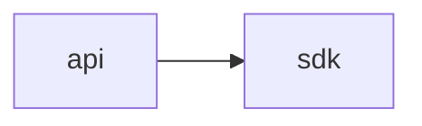

# TariffShield Dependency Graph

This document shows the dependency relationships between workspace packages in the TariffShield monorepo.

## Current Package Dependencies



## Package Descriptions

- **@tariffshield/api** - Express REST API server with Soroban indexer
- **@tariffshield/web** - Next.js frontend application
- **@tariffshield/sdk** - TypeScript SDK for TariffShield Soroban contract

## Generating the Graph

To regenerate this visualization:

```bash
# Generate Mermaid format (for GitHub Markdown)
npm run dep-graph

# Generate DOT format (for Graphviz rendering)
npm run dep-graph -- --format dot

# Generate SVG (requires Graphviz installed)
make dep-graph
```

## Installing Graphviz

To generate SVG output:

**Ubuntu/Debian:**

```bash
sudo apt-get install graphviz
```

**macOS:**

```bash
brew install graphviz
```

**Then run:**

```bash
make dep-graph
```

This will create `docs/dep-graph.svg`.

## Circular Dependency Detection

The `dep-graph.ts` script automatically detects circular dependencies and exits with a non-zero status code if any are found, preventing them from being introduced.
