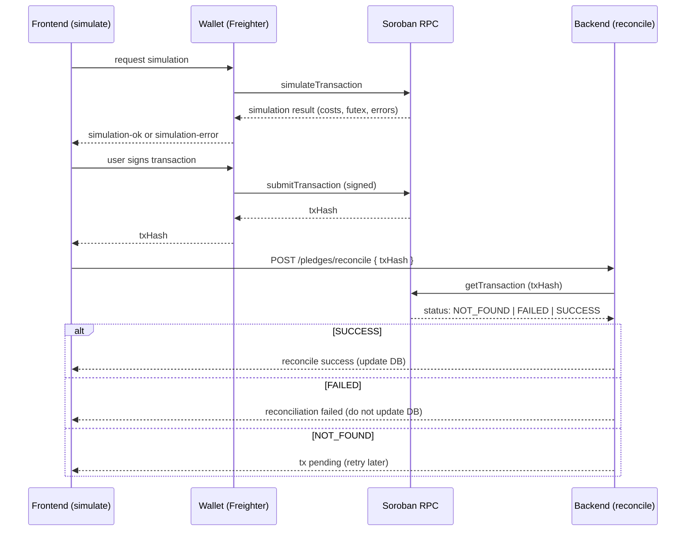

# Soroban RPC: simulate → sign → submit → reconcile

This document explains the Soroban RPC interaction patterns used by Stellar Goal Vault,
particularly the simulate → sign → submit → reconcile flow used by the frontend and
backend when creating on-chain pledges, claims, and refunds.

**Why this doc exists**
- The code in `backend/src/services/sorobanRpc.ts` interacts with a Soroban JSON-RPC
  node. That file contains logic to verify transaction results and map Soroban RPC
  responses to application-level errors. This doc explains the end-to-end flow,
  common failure modes, and how callers should react.

**High-level flow**

1. Simulate (frontend): the wallet (e.g., Freighter) simulates a transaction against the
   Soroban contract to estimate fees, check preconditions, and detect early failures.
2. Sign (user wallet): the user signs the simulated transaction using their wallet.
3. Submit (wallet/network): the signed transaction is submitted to the Soroban RPC/node.
4. Reconcile (backend): once the frontend receives a transaction hash, the backend
   verifies on-chain success via `getTransaction` before updating local state (reconcile).



Why simulation is required before signing
- Simulation provides deterministic feedback about whether the transaction would
  succeed or fail if submitted. It helps:
  - Avoid unnecessary user signatures for transactions that would fail (bad inputs, insufficient balance, contract preconditions).
  - Estimate fees and resource usage so the frontend can show realistic UX.
  - Catch predictable execution failures (e.g., contract-level validations) without broadcasting signed payloads.

Known RPC error codes and application mapping

- `SOROBAN_REFUND_NOT_CONFIGURED` (503): Missing `CONTRACT_ID` or backend refund config.
  - Action: Fix backend env (set `CONTRACT_ID`) or prevent the refund flow on frontend.
- `SOROBAN_RPC_NOT_CONFIGURED` (503): Missing `SOROBAN_RPC_URL`.
  - Action: Configure RPC URL in backend env.
- `SOROBAN_RPC_INVALID_RESPONSE` (502): RPC returned empty/malformed body for `getTransaction`.
  - Action: Treat as transient RPC failure; surface 502 to caller and consider retry with backoff.
- `SOROBAN_RPC_UNAVAILABLE` (502): Network error or RPC unreachable.
  - Action: Retry with exponential backoff; surface error to client and optionally show maintenance notice.
- `SOROBAN_TX_PENDING` (409): RPC reports `NOT_FOUND` — transaction not yet included.
  - Action: Retry verification after a delay (e.g., 3–10 seconds), or use an event indexer when available.
- `SOROBAN_TX_FAILED` (400): RPC reports transaction executed but failed.
  - Action: Do not reconcile local DB. Surface failure reason to the user (if available) and log details.

Guidance for callers (backend and frontend)

- Frontend: always simulate before asking the user to sign. If the simulation fails, show a clear error and do not continue.
- Wallet: after submitting a signed tx, return the `txHash` to the frontend as soon as possible.
- Backend: when reconciling via `verifyRefundTransaction(txHash)`:
  - Validate `config` with `ensureSorobanRefundConfig()`.
  - Call `getTransaction` and interpret statuses as above.
  - For `NOT_FOUND`, treat as transient and retry; for `FAILED`, abort reconcile and report.
  - For `SUCCESS`, use returned ledger metadata to mark local state and append an event to history.

Testing and verification steps (how you can validate your assignment)

1. Open the repository in your dev environment.
2. Confirm `backend/src/services/sorobanRpc.ts` contains expanded JSDoc and inline comments.
   - Search for `verifyRefundTransaction` and `ensureSorobanRefundConfig` to verify they have JSDoc `@throws` entries for the mapped errors.
3. Run TypeScript compile / quick-check in the repo root:

```bash
npm run install:all
npm run build
```

4. Start the backend locally and ensure it starts without configuration errors (if `CONTRACT_ID` is missing set a dummy value to exercise code paths):

```bash
cd backend
npm run dev:backend
```

5. (Optional) If you have a Soroban RPC URL and a known transaction hash, call the backend reconcile endpoint that uses `verifyRefundTransaction` or call the function directly from a small test harness.

6. Lint or run tests (if available):

```bash
npm run lint
npm test
```

7. Manual code review: open [backend/src/services/sorobanRpc.ts](backend/src/services/sorobanRpc.ts) and confirm:
   - Every function has a JSDoc explaining purpose, params, and `@throws` for known error conditions.
   - Inline comments explain the JSON-RPC body and the mapping of RPC statuses to `AppError` codes.

If all of the above are present and the project builds, your assignment is complete.

Additional notes
- For production, consider adding an event indexer that listens for on-chain events instead of polling `getTransaction` repeatedly. This improves latency and reduces RPC load.
- Surface granular RPC error messages (when safe) to help users understand `FAILED` causes — e.g., contract-level errors returned in the RPC metadata.
